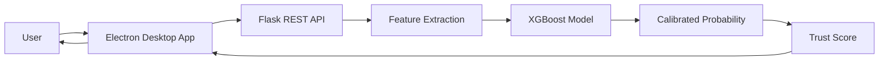
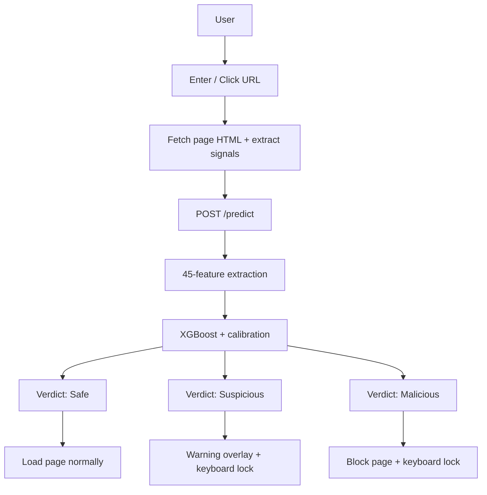

<div align="center">


# 🛡️ Trust Flow

### AI-Powered Zero-Trust Browser Security Platform

**Detect. Analyze. Protect.**

*A desktop security application that combines Machine Learning with Zero-Trust principles to identify phishing websites in real time — before you ever type a password into them.*

<p align="center">
  
  
  
  
  
  
</p>

<p align="center">
  
</p>

<p align="center">
  <a href="#-installation"></a>
  <a href="https://github.com/DANYALFAYAZ804/Final-Year-Project/releases/latest"></a>
</p>

---

### 🚀 Built With

<p align="center">
  
</p>

</div>

---

## 🎥 Demo

<div align="center">

*A short walkthrough of Trust Flow scanning a site and blocking a phishing attempt in real time.*


> Replace `docs/screenshots/demo.gif` with a screen recording of the app in action — a GIF under ~15MB embeds directly and autoplays on GitHub without any extra setup.

</div>

---

# 📑 Table of Contents

- [Overview](#-overview)
- [Key Objectives](#-key-objectives)
- [Features](#-features)
- [Why Trust Flow?](#-why-trust-flow)
- [System Architecture](#️-system-architecture)
- [Technology Stack](#-technology-stack)
- [🔒 Threat Detection Engine](#-threat-detection-engine)
- [Project Structure](#-project-structure)
- [Installation](#-installation)
- [Usage](#️-running-the-project)
- [API Documentation](#-rest-api-documentation)
- [Testing](#-testing)
- [Screenshots](#-screenshots)
- [Roadmap](#️-roadmap)
- [FAQ](#-faq)
- [Contributing](#-contributing)
- [Contributors](#-contributors)
- [Citation](#-citation)
- [License](#-license)
- [Contact](#-contact)

---

# 📖 Overview

Trust Flow is an AI-powered desktop application developed to combat phishing attacks using Machine Learning while following a **Zero-Trust security model**.

Unlike traditional browser security solutions that rely primarily on static blacklists, Trust Flow analyzes dozens of structural and behavioral characteristics of a URL — and, where possible, the page's actual content — before determining whether it is safe or potentially malicious.

The Electron desktop application communicates with a Flask backend over a REST API, where a trained XGBoost classifier evaluates incoming URLs and returns a prediction along with a calibrated confidence score.

---

# 🎯 Key Objectives

- Detect phishing websites before users interact with them
- Apply Zero-Trust security principles — nothing is trusted by default
- Reduce reliance on static, easily-outdated blacklists
- Provide confidence-scored, explainable predictions
- Deliver a fast, modern desktop browsing experience

---

# ✨ Features

## 🛡️ Security
- Real-time phishing detection on every navigation
- Zero-Trust architecture — even known-safe domains are re-checked if content looks suspicious
- Page-content inspection (password field detection, external resource analysis)
- Domain-age intelligence via WHOIS/RDAP lookups
- VirusTotal community threat-data cross-referencing
- Curated whitelist for well-known, high-traffic domains

## 🤖 Machine Learning
- 45-feature extraction pipeline per URL
- XGBoost classifier, hyperparameter-tuned with Optuna
- Sigmoid-calibrated probability outputs
- SMOTE-based class balancing during training
- Homograph and punycode lookalike-domain detection

## 💻 Desktop Application
- Built with Electron + Vite
- Multi-tab browsing with a dedicated New Tab page
- Live trust-score shield badge in the address bar
- Keyboard-lock protection on suspicious/malicious pages
- Wizard-style Windows installer (license page, custom install directory)

## ⚡ Backend
- Flask REST API with CORS support
- Stateless `/predict` endpoint
- Deployed on Railway with zero-downtime redeploys on push
- Graceful heuristic fallback if the ML model is ever unavailable

---

# ⭐ Why Trust Flow?

Traditional browser security mainly depends on blacklists, which fail against **newly registered phishing domains** that haven't been reported yet. Trust Flow's ML-driven approach evaluates structural and behavioral characteristics that correlate with phishing regardless of whether the domain has ever been seen before — including domains that are technically "clean" by reputation but serve malicious content on a specific page (the same trick used by Google's own Safe Browsing test pages).

---

# 🏗️ System Architecture



## 🔐 Zero-Trust Request Flow



---

# 🧰 Technology Stack

## Frontend
| Technology | Purpose |
|---|---|
| Electron | Desktop application shell |
| Vite | Build tooling & bundling |
| HTML5 / CSS3 | UI structure & styling |
| JavaScript (ESM) | Application logic |

## Backend
| Technology | Purpose |
|---|---|
| Python | Backend language |
| Flask | REST API framework |
| Flask-CORS | Cross-origin support |
| Gunicorn | Production WSGI server |

## Machine Learning
| Technology | Purpose |
|---|---|
| XGBoost | Gradient-boosted classifier |
| Scikit-Learn | Calibration, splitting, metrics |
| Imbalanced-Learn (SMOTE) | Class balancing |
| Optuna | Hyperparameter search |
| NumPy / Pandas | Feature & data handling |
| Joblib | Model serialization |

## Deployment
| Platform | Usage |
|---|---|
| Railway | Backend hosting (auto-deploy on push) |
| Vercel | Landing / download page |
| GitHub Releases | Installer distribution |
| Electron Forge + WiX | Windows installer packaging |

---

# 🔒 Threat Detection Engine

Trust Flow's classifier evaluates **45 features** per URL, grouped into five categories:

| Category | Examples | Why it matters |
|---|---|---|
| **Lexical** | URL length, digit count, special-character density | Phishing URLs are often longer and noisier than legitimate ones |
| **Domain structure** | subdomain depth, hyphen count, entropy | Randomly-generated or padded domains score differently than real brand domains |
| **Reputation** | TLD reputation score, brand-authority tier | `.gov`/`.edu` and known brand SLDs score categorically higher than `.tk`/`.xyz` etc. |
| **Brand-impersonation** | Levenshtein homograph distance to known brand names, punycode (`xn--`) detection | Catches lookalikes like `paypa1.com` or IDN homograph attacks |
| **Behavioral** | Password field presence, external-resource ratio | Distinguishes a credential-harvesting page from a normal one, even on an otherwise clean-looking domain |

The model is an **XGBoost classifier**, tuned via Optuna hyperparameter search and calibrated with sigmoid scaling so that its output can be read as a genuine probability rather than a raw decision score. Class imbalance in training data is corrected using SMOTE oversampling.

**Final trust score** is a weighted blend of three independent signals:

```
final_score = (ML_score × 0.50) + (VirusTotal_score × 0.35) + (WHOIS_domain_age_score × 0.15)
```

| Score range | Verdict |
|---|---|
| ≥ 75 | ✅ Safe |
| 40–74 | ⚠️ Suspicious |
| < 40 | ⛔ Malicious |

A hardcoded whitelist fast-passes a curated set of major, high-traffic domains — **unless** the page itself is found to contain a password field, in which case it's scored fully regardless of domain reputation. This closes the gap that pure domain-whitelisting normally leaves open (a clean domain hosting a malicious page).

---

# 📁 Project Structure

```text
Final-Year-Project/
│
├── backend/
│   ├── app.py              # Flask API: /, /health, /predict
│   ├── train.py            # Dataset generation + model training
│   ├── model.pkl           # Trained, calibrated XGBoost classifier
│   └── requirements.txt
│
├── src/
│   ├── assets/              # Icons, logo (.ico + .png)
│   ├── index.html
│   ├── index.css
│   ├── main.js              # Electron main process + trust score engine
│   ├── preload.js           # IPC bridge
│   ├── renderer.js          # UI logic, tabs, shield badge
│   └── config-store.js
│
├── out/                      # Build output (git-ignored)
│
├── forge.config.js
├── package.json
├── LICENSE
└── README.md
```

---

# ⚙️ Prerequisites

| Software | Version |
|---|---|
| Node.js | 18+ |
| npm | Latest |
| Python | 3.11+ |
| Git | Latest |
| WiX Toolset v3 | Required only to build the Windows installer |

---

# 🚀 Installation

## For end users (no dev setup needed)

Download the latest Windows installer directly:

<p align="center">
  <a href="https://github.com/DANYALFAYAZ804/Final-Year-Project/releases/latest">
    
  </a>
</p>

> Trust Flow isn't code-signed yet, so Windows SmartScreen may show a warning on first run — this is expected for free, unsigned software. Click **More info → Run anyway** to proceed.

## For developers

**1. Clone the repository**
```bash
git clone https://github.com/DANYALFAYAZ804/Final-Year-Project.git
cd Final-Year-Project
```

**2. Install desktop dependencies**
```bash
npm install
```

**3. Install backend dependencies**
```bash
pip install -r backend/requirements.txt
```

---

# ▶️ Running the Project

### Start the Flask backend
```bash
cd backend
python app.py
```
Runs at `http://127.0.0.1:5000`

### Start the Electron desktop app
```bash
npm start
```

### Build the Windows installer
```bash
npm run make
```
Output: `out/make/wix/x64/*.msi`

---

# 📡 REST API Documentation

Base URL (production): `https://final-year-project-production-9edf.up.railway.app`

## `GET /`
Health/status check for the root of the service.

**Response**
```json
{
  "status": "online",
  "message": "Trust Flow Backend is Running"
}
```

## `GET /health`
Reports whether the ML model is actually loaded, vs. running on heuristic fallback.

**Response**
```json
{
  "status": "ok",
  "model_loaded": true,
  "model_version": "4.0"
}
```

## `POST /predict`
Scores a single URL.

**Request body**
```json
{
  "url": "https://example.com",
  "has_password_field": 0,
  "external_resource_ratio": 0.0,
  "force_scan": false
}
```
| Field | Type | Required | Description |
|---|---|---|---|
| `url` | string | ✅ yes | The URL to evaluate |
| `has_password_field` | int (0/1) | optional | Whether the fetched page contains a password input |
| `external_resource_ratio` | float (0–1) | optional | Fraction of page resources loaded from a different domain |
| `force_scan` | bool | optional | Forces full scoring even for whitelisted domains |

**Response — ML-scored**
```json
{
  "score": 0.0421,
  "label": "phishing",
  "confidence": 0.9812,
  "phishing_probability": 0.9579,
  "whitelist": false
}
```

**Response — whitelisted fast-pass**
```json
{
  "score": 1.0,
  "label": "safe",
  "confidence": 1.0,
  "phishing_probability": 0.0,
  "whitelist": true
}
```

| Label | Meaning |
|---|---|
| `safe` | Legitimate site |
| `phishing` | Likely malicious / credential-harvesting site |

---

# 🧪 Testing

## Example: known-safe URL
```bash
curl -X POST https://final-year-project-production-9edf.up.railway.app/predict \
  -H "Content-Type: application/json" \
  -d "{\"url\": \"https://www.google.com\"}"
```
**Expected response**
```json
{ "score": 1.0, "label": "safe", "confidence": 1.0, "phishing_probability": 0.0, "whitelist": true }
```

## Example: structurally suspicious URL
```bash
curl -X POST https://final-year-project-production-9edf.up.railway.app/predict \
  -H "Content-Type: application/json" \
  -d "{\"url\": \"http://paypal-account-update.cf/login\"}"
```
**Expected response** — high `phishing_probability`, `label: "phishing"`.

## Example: password field on an otherwise clean-looking page
```bash
curl -X POST https://final-year-project-production-9edf.up.railway.app/predict \
  -H "Content-Type: application/json" \
  -d "{\"url\": \"http://testsafebrowsing.appspot.com/s/phishing.html\", \"has_password_field\": 1, \"external_resource_ratio\": 0.5, \"force_scan\": true}"
```
**Expected response** — meaningfully lower safety score than a plain URL-only check, since the whitelist fast-pass is bypassed when `force_scan` is set.

---

# 📸 Screenshots

<div align="center">

**New Tab — Home**


**Verified Safe — Trust Score Breakdown**


**Suspicious Site Detected — Keyboard Locked**


</div>

---

# 🗺️ Roadmap

## ✅ Version 1.0
- Desktop application (Electron)
- ML-based phishing detection (XGBoost)
- Flask REST API on Railway
- Whitelist + behavioral signal scoring
- Windows installer (WiX wizard)

## 🚀 Version 2.0
- Browser extension
- Browsing history scanner
- AI-generated threat explanations
- Automatic threat reporting
- Dark mode & expanded settings panel

## 🔥 Version 3.0
- Real-time site monitoring
- Cloud dashboard
- Multi-user / enterprise management
- Automatic model retraining pipeline
- macOS & Linux support

---

# ❓ FAQ

**Is Trust Flow production-ready?**
It's a functional, actively-tested final year project with a real ML pipeline and live backend — solid for demonstration and personal use, but not yet hardened for enterprise deployment (no code signing, no automated model retraining loop).

**Does it work offline?**
No — `/predict` requires reaching the Railway-hosted backend. If the backend is unreachable, the app fails safe to a neutral default score rather than blocking all browsing.

**Why is it Windows-only right now?**
The installer is currently built with WiX (Windows-only). macOS/Linux packaging is on the roadmap — the Electron codebase itself is cross-platform, just not yet packaged for those targets.

**Does Trust Flow collect or store my browsing data?**
No user browsing data is persisted server-side. Each `/predict` call is stateless; only the URL (and optional page signals) are sent for scoring.

**Why does Windows show a security warning when I install it?**
Trust Flow isn't code-signed (that requires a paid certificate). This is expected for free/unsigned software — click "More info → Run anyway" to proceed.

**Can I use my own VirusTotal API key?**
Yes — add it in the in-app Settings panel to enable VirusTotal cross-referencing.

**How is the ML model trained?**
See [`backend/train.py`](backend/train.py) — a labeled dataset of safe and phishing URLs (including synthetic homograph/punycode variants) is used to train and calibrate an XGBoost classifier, validated against a held-out unseen-URL test set.

---

# 🤝 Contributing

1. Fork this repository
2. Create a branch: `git checkout -b feature/NewFeature`
3. Commit: `git commit -m "Add New Feature"`
4. Push: `git push origin feature/NewFeature`
5. Open a Pull Request

---

# 👥 Contributors

<a href="https://github.com/DANYALFAYAZ804/Final-Year-Project/graphs/contributors">
  
</a>

## 🌟 Project Lead

<table>
<tr>
<td align="center">
<br>
<b>Danyal Fayaz</b><br>
Project Lead · ML Engineer · Full-Stack Developer
</td>
</tr>
</table>

---

# 📖 Citation

If you reference Trust Flow in academic or research work, please cite it as:

```bibtex
@software{fayaz2026trustflow,
  author  = {Fayaz, Danyal},
  title   = {Trust Flow: AI-Powered Zero-Trust Browser Security Platform},
  year    = {2026},
  url     = {https://github.com/DANYALFAYAZ804/Final-Year-Project},
  note    = {Final Year Project}
}
```

---

# 📄 License

This project is licensed under the **MIT License** — see [`LICENSE`](LICENSE) for details.

---

# 🙏 Acknowledgements

Electron · Flask · Scikit-Learn · XGBoost · Optuna · NumPy · Pandas · Railway · GitHub · Visual Studio Code

---

# 📬 Contact

**Danyal Fayaz**

📧 danyalfayaz892@gmail.com
🌐 [github.com/DANYALFAYAZ804](https://github.com/DANYALFAYAZ804)
💼 [LinkedIn](https://www.linkedin.com/in/danyal-fayaz-b84820373)

---

<div align="center">

### 🛡️ Trust Flow — *"Don't Trust. Verify."*

⭐ If this project was useful to you, consider starring the repository.

</div>
