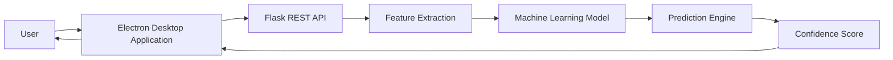
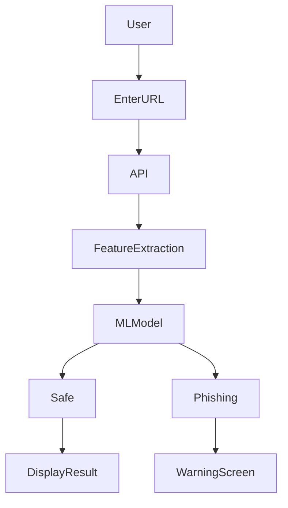
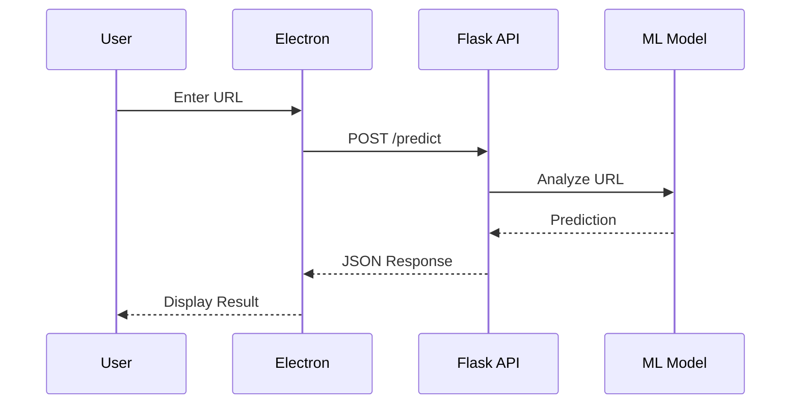

<div align="center">

# 🛡️ Trust Flow

### AI-Powered Zero Trust Browser Security Platform

**Detect. Analyze. Protect.**

A modern desktop security application that leverages Machine Learning and Zero Trust principles to identify phishing websites in real time and provide users with a safer browsing experience.

<p align="center">


</p>

---

### 🚀 Built With

<p align="center">


</p>

</div>

---

# 📑 Table of Contents

- Overview
- Features
- Why Trust Flow?
- Architecture
- Technology Stack
- Machine Learning Pipeline
- Project Structure
- Installation
- Usage
- API Documentation
- Screenshots
- Roadmap
- Contributors
- Contributing
- License
- Contact

---

# 📖 Overview

Trust Flow is an AI-powered desktop application developed to combat phishing attacks using Machine Learning while following a Zero Trust Security model.

Unlike traditional browser security solutions that rely primarily on blacklists, Trust Flow analyzes multiple characteristics of a URL before determining whether it is safe or potentially malicious.

The desktop application communicates with a Flask backend through REST APIs, where a trained Machine Learning model evaluates incoming URLs and returns a prediction along with a confidence score.

The primary goal of Trust Flow is to provide users with an intelligent, lightweight, and real-time phishing detection solution capable of improving browsing security without sacrificing performance.

---

# 🎯 Key Objectives

- Detect phishing websites before users visit them
- Improve online browsing security
- Apply Zero Trust security principles
- Reduce phishing-related cyber attacks
- Provide confidence-based predictions
- Deliver a modern desktop experience

---

# ✨ Features

## 🛡️ Security

- Real-time phishing detection
- Zero Trust architecture
- Secure REST API communication
- URL reputation analysis
- Trusted website whitelist
- Confidence-based predictions

---

## 🤖 Machine Learning

- URL feature extraction
- Trained phishing classification model
- High prediction accuracy
- Fast inference
- Optimized preprocessing pipeline

---

## 💻 Desktop Application

- Built using Electron
- Modern UI
- Responsive design
- Fast navigation
- Cross-platform architecture
- Easy installation

---

## ⚡ Backend

- Flask REST API
- JSON responses
- Modular architecture
- Railway deployment
- Easy scalability

---

# ⭐ Why Trust Flow?

Traditional browser security mainly depends on blacklists, which often fail to detect newly created phishing websites.

Trust Flow introduces a Machine Learning-powered approach that evaluates website characteristics in real time, allowing the application to identify suspicious websites even if they have never appeared in any blacklist before.

This Zero Trust approach ensures that every URL is verified before being trusted.

---

# 🏗️ System Architecture



---

# 🔐 Zero Trust Workflow



---

# 🧰 Technology Stack

## Frontend

| Technology | Purpose |
|------------|---------|
| Electron | Desktop Application |
| HTML5 | User Interface |
| CSS3 | Styling |
| JavaScript | Application Logic |

---

## Backend

| Technology | Purpose |
|------------|---------|
| Python | Backend Development |
| Flask | REST API |
| Flask-CORS | Cross-Origin Support |

---

## Machine Learning

| Technology | Purpose |
|------------|---------|
| Scikit-Learn | Model Training |
| XGBoost | Classification |
| NumPy | Numerical Computing |
| Pandas | Data Processing |
| Joblib | Model Serialization |
| Optuna | Hyperparameter Optimization |
| Imbalanced-Learn | Dataset Balancing |

---

## Deployment

| Platform | Usage |
|----------|-------|
| Railway | Backend Hosting |
| GitHub | Version Control |
| Electron Forge | Desktop Packaging |

---

# 📈 Machine Learning Pipeline

```text
User URL
     │
     ▼
Feature Extraction
     │
     ▼
Preprocessing
     │
     ▼
Machine Learning Model
     │
     ▼
Prediction
     │
     ▼
Confidence Score
     │
     ▼
Desktop Application
```

---
# 📁 Project Structure

```text
Trust-Flow/
│
├── backend/
│   ├── app.py
│   ├── requirements.txt
│   ├── models/
│   ├── utils/
│   ├── routes/
│   └── saved_model/
│
├── src/
│   ├── assets/
│   ├── css/
│   ├── js/
│   ├── images/
│   ├── main.js
│   ├── preload.js
│   └── renderer.js
│
├── out/
│
├── forge.config.js
├── package.json
├── package-lock.json
├── README.md
└── LICENSE
```

---

# ⚙️ Prerequisites

Before running Trust Flow locally, ensure you have the following installed:

| Software | Version |
|-----------|----------|
| Node.js | 18+ |
| npm | Latest |
| Python | 3.11+ |
| Git | Latest |

---

# 🚀 Installation

## 1️⃣ Clone the Repository

```bash
git clone https://github.com/DANYALFAYAZ804/Final-Year-Project.git

cd Final-Year-Project
```

---

## 2️⃣ Install Desktop Dependencies

```bash
npm install
```

---

## 3️⃣ Install Backend Dependencies

```bash
pip install -r backend/requirements.txt
```

---

## ▶️ Running the Project

### Start Flask Backend

```bash
cd backend

python app.py
```

Backend will start at

```
http://127.0.0.1:5000
```

---

### Start Electron Desktop

```bash
npm start
```

Electron Forge will launch the desktop application.

---

# 📦 Build Executable

Generate the desktop installer

```bash
npm run make
```

Output:

```
out/make/
```

Contains

- Windows Installer (.exe)
- Desktop package

---

# 🌐 Backend Deployment

Trust Flow supports deployment of the backend on cloud platforms such as:

- Railway
- Render
- Azure App Service

Example API endpoint:

```text
https://your-backend.up.railway.app/predict
```

---

# 🔄 Application Workflow



---

# 📡 REST API

## POST `/predict`

Predict whether a URL is safe or phishing.

### Request

```json
{
    "url":"https://example.com"
}
```

---

### Response

```json
{
    "label":"Safe",
    "confidence":0.99,
    "score":1.0,
    "whitelist":true
}
```

---

### Possible Labels

| Label | Description |
|---------|-------------|
| Safe | Legitimate Website |
| Phishing | Malicious Website |

---

# 🧠 Machine Learning Pipeline

The phishing detection engine follows the workflow below:

```
Input URL
      │
      ▼
Feature Extraction
      │
      ▼
Data Cleaning
      │
      ▼
Feature Engineering
      │
      ▼
Machine Learning Model
      │
      ▼
Prediction
      │
      ▼
Confidence Score
      │
      ▼
Desktop Interface
```

---

# 📊 Prediction Output

Trust Flow provides:

- Classification Result
- Confidence Score
- Prediction Score
- Whitelist Status
- Security Recommendation

---

# 🔒 Security Principles

Trust Flow follows a Zero Trust philosophy.

Every URL is:

✅ Verified

✅ Evaluated

✅ Classified

before being trusted.

No website is automatically considered safe without verification.

---

# ⚡ Performance

- Fast prediction response
- Lightweight desktop application
- Optimized ML inference
- Low memory usage
- Responsive user interface

---

# 🌍 Cross Platform

| Operating System | Status |
|------------------|---------|
| Windows | ✅ Supported |
| Linux | 🚧 Planned |
| macOS | 🚧 Planned |

---

# 🛠 Configuration

The backend endpoint can be configured inside the Electron application.

Development

```text
http://127.0.0.1:5000
```

Production

```text
https://your-backend.up.railway.app
```

---

# 📌 Environment Variables

Create a `.env` file inside the backend directory.

```env
FLASK_ENV=production
PORT=5000
MODEL_PATH=models/phishing_model.pkl
```

---

# 🧪 Testing

Example using cURL

```bash
curl -X POST \
http://127.0.0.1:5000/predict \
-H "Content-Type: application/json" \
-d "{\"url\":\"https://google.com\"}"
```

Expected Response

```json
{
  "label":"Safe",
  "confidence":1.0,
  "score":1.0
}
```

---

# 📈 Deployment Pipeline

```text
GitHub
   │
   ▼
Push Code
   │
   ▼
Railway Deploys Backend
   │
   ▼
Electron Desktop Connects
   │
   ▼
Real-Time URL Analysis
```

---

# 💡 Best Practices

- Keep the ML model updated.
- Use HTTPS for all API communication.
- Regularly retrain the phishing detection model.
- Protect API endpoints against abuse.
- Package desktop releases using Electron Forge.
- Enable automatic updates for future releases.

---
# 📸 Screenshots

> **Coming Soon**

Add screenshots of the application here.

<div align="center">

| Home | Safe Website |
|------|--------------|
|  |  |

| Phishing Detection | URL Analysis |
|--------------------|--------------|
|  |  |

</div>

---

# 🎥 Demo

A demonstration video of Trust Flow will be available soon.

```
Demo Video
Coming Soon...
```

---

# 🗺️ Roadmap

## ✅ Version 1.0

- Desktop Application
- Machine Learning Detection
- Flask REST API
- Railway Deployment
- URL Classification
- Confidence Score
- Whitelist Detection

---

## 🚀 Version 2.0

- Browser Extension
- Browser History Scanner
- AI Threat Explanation
- Automatic Threat Reporting
- URL Reputation Database
- Dark Mode
- Settings Panel

---

## 🔥 Version 3.0

- Real-time Website Monitoring
- Cloud Dashboard
- Multi-user Support
- Enterprise Management
- AI Threat Intelligence
- Automatic Model Updates
- Cross-platform Support

---

# 🤝 Contributing

Contributions are welcome!

If you would like to contribute:

1. Fork this repository

2. Create a new branch

```bash
git checkout -b feature/NewFeature
```

3. Commit your changes

```bash
git commit -m "Add New Feature"
```

4. Push your branch

```bash
git push origin feature/NewFeature
```

5. Open a Pull Request

---

# 👥 Contributors

Thanks to everyone who contributes to Trust Flow.

<a href="https://github.com/DANYALFAYAZ804/Final-Year-Project/graphs/contributors">

</a>

---

## 🌟 Project Lead

<table>
<tr>

<td align="center">


### Danyal Fayaz

Project Lead

Machine Learning Engineer

Desktop Application Developer

Backend Developer

</td>

</tr>
</table>

---

# 🏆 Project Highlights

✔ AI Powered

✔ Machine Learning

✔ Zero Trust Security

✔ Desktop Application

✔ Electron

✔ Flask

✔ REST API

✔ Railway Deployment

✔ Modern UI

✔ Real-Time Detection

---

# 📊 Repository Statistics


---

# 🛡️ Security

If you discover a security vulnerability, please open an Issue or contact the maintainer directly before publicly disclosing it.

---

# 📄 License

This project is licensed under the **MIT License**.

See the **LICENSE** file for more information.

---

# 🙏 Acknowledgements

Special thanks to:

- OpenAI
- Electron
- Flask
- Scikit-Learn
- XGBoost
- NumPy
- Pandas
- Railway
- GitHub
- Visual Studio Code

---

# ⭐ Support

If you found this project useful,

please consider giving it a ⭐ on GitHub.

It helps the project grow and motivates future development.

---

# 📬 Contact

## 👨‍💻 Danyal Fayaz

📧 Email: danyalfayaz892@gmail.com.com

🌐 GitHub: https://github.com/DANYALFAYAZ804

💼 LinkedIn: https://www.linkedin.com/in/danyal-fayaz-b84820373?utm_source=share_via&utm_content=profile&utm_medium=member_android

---

<div align="center">

# 🛡️ Trust Flow

### "Don't Trust. Verify."

### Built with ❤️ using Machine Learning, Python, Flask & Electron

⭐ If you like this project, don't forget to star the repository!

</div>
